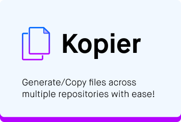

[](https://lgtm.com/projects/g/bjerkio/kopier/context:javascript)
[](https://codecov.io/gh/bjerkio/kopier)
[](https://codeclimate.com/github/bjerkio/kopier/maintainability)

# Kopier

Kopier is a Github Action made to generate/copy files across multiple repositories. The software is inspired
initially by [Copybara](https://github.com/google/copybara) and a continuation of [Tabetalt's Kopier](https://github.com/tabetalt/kopier).

## Features

- Copy files to multiple repositories.
- Generate files (such as Github Actions files) with a [Handlebarsjs](https://handlebarsjs.com/).
- When templates or files are changed, you can create a pull request for each repository.

## Use cases

Kopier was made to make it easier to handle repeatable tasks when working with a multi-repository setup.
In our case, we work with many microservices separated in multiple repositories. We want to make sure we are
running the same Github Actions workflow for each, but there are differences, like the name etc.

## Example Usage

```yaml
jobs:
  build:
    steps:
      - uses: bjerkio/kopier@main
        with:
          query: 'org:bjerkio'
```

## Input

### `github-token`

Default is ${{ github.token }}.

### `query`

Search for repositories you want to query. Learn [how to search for
repositories on Github Docs](https://docs.github.com/en/github/searching-for-information-on-github/searching-on-github/searching-for-repositories).

**Note**: You cannot combine `query` with `repos`.

### `repos`

List of repositories to add files to.

**Example**:

```yaml
steps:
  - uses: bjerkio/kopier@main
    with:
      repos: |
        bjerkio/kopier
        bjerkio/oidc-react
```

### `base-path`

Base path for in the repositories, e.g. `.github/workflows`.

Default is `templates/`.

### `commit-message`

Commit message.

Default is `chore(kopier): {{commit.subject}}`.

### `title`

Pull Request title.

Default is `chore(kopier): {{commit.subject}}`.

### `body`

Pull Request body.

Default is [found in src/pr-message.ts](src/pr-message.ts).

### `head`

A branch name for updates.

Default is `kopier-{{ commit sha }}`.

### `base`

Base-branch is where the pull request is opened.

Defaults to default branch

# Documentation

Apart from this README, you can find details and examples of using the SDK in the following places:

- [Github Actions Documentation](https://help.github.com/en/actions)

# Similar tools

- [adrianjost/files-sync-action](https://github.com/adrianjost/files-sync-action)
- [andsor/copycat-action](https://github.com/marketplace/actions/copycat-action)
- [jkcfg/jk](https://github.com/jkcfg/jk)
- [Clever/microplane](https://github.com/Clever/microplane)

# Contribute

Feel free to open issues and pull requests. We appreciate all the help we can get! 🎉
